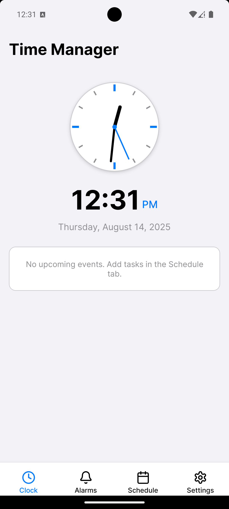
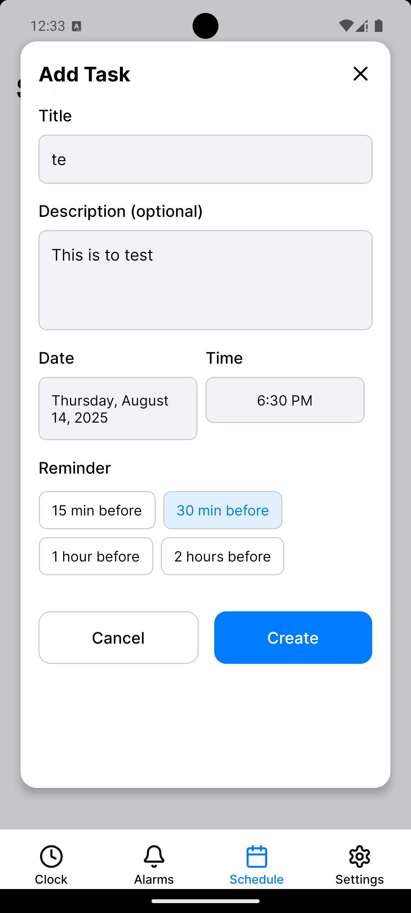
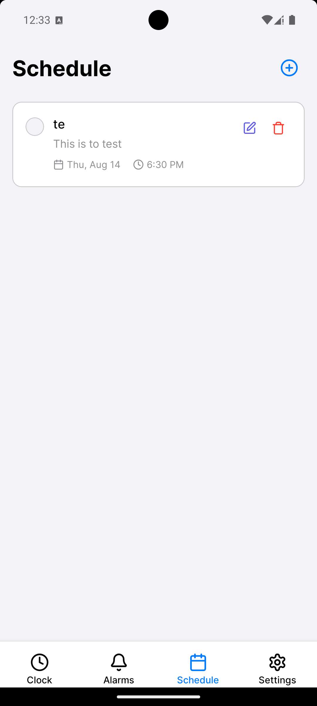
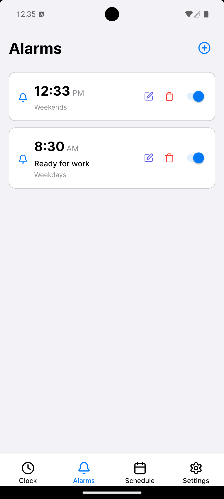
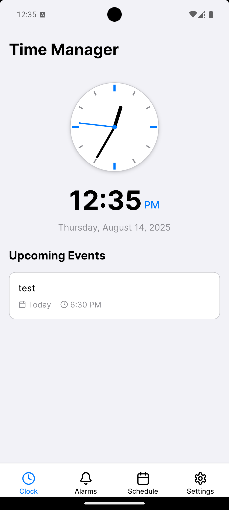
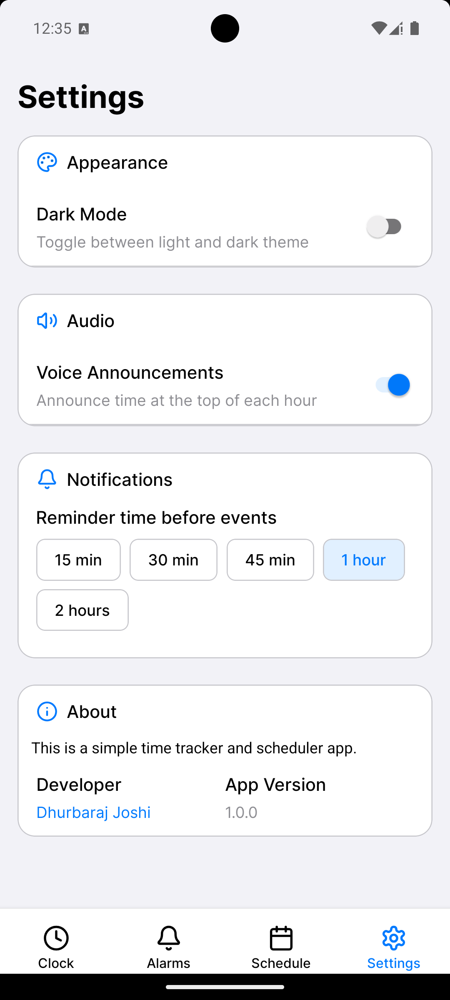
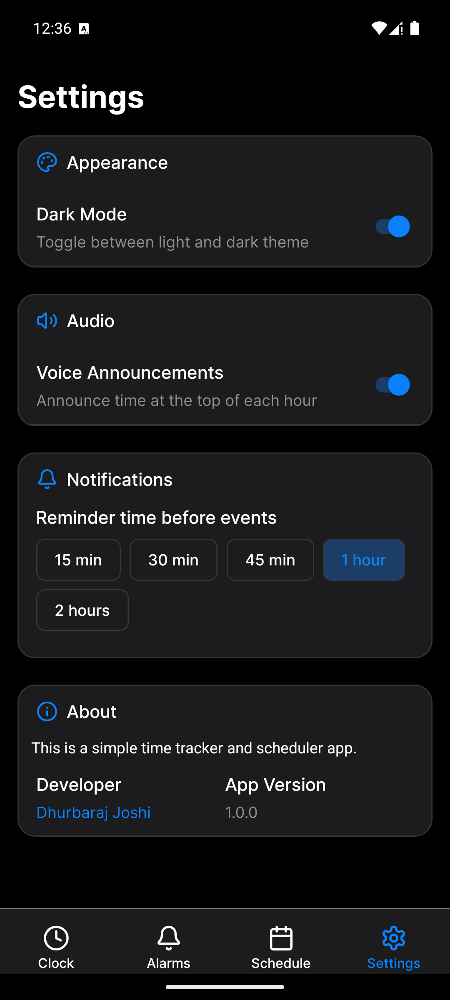

# ⏰ my-times — Android App Release Guide

**my-times** is a modern, customizable alarm clock app built with **React Native** and **Expo**. This guide walks you through preparing, signing, and publishing the app to the **Google Play Store**.


## 📦 App Overview

> A modern, offline-friendly alarm clock with themes, haptics, and repeat features.

### ✨ Features

- ⏰ Set alarms with custom time and label
- 🔁 Repeat alarms on selected weekdays
- 🌓 Light & dark theme support
- 📳 Haptic feedback (Expo Haptics)
- 📦 Offline local storage
- 🎨 Beautiful UI (Expo Blur, Safe Area, Lucide Icons)
- 📤 Ready for Play Store release


## 🚀 Screenshots

<p align="center">
  
  
  
  
  
  
  
</p>


## 🧩 Folder Structure

<pre>
.
├── components/
│   └── Alarms/
│   └── Clock/
│   └── Schedule/
├── context/
│   └── ThemeContext.tsx
├── hooks/
│   └── useAlarms.ts
│   └── useFrameworkReady.ts
│   └── useTasks.ts
│   └── useVoiceAnnouncements.ts
├── assets/images/
│   ├── icon.png
│   └── splash.png
├── App.tsx
└── ...
</pre>

## 🔐 PART 1: Create a Keystore & Signing Config

### ✅ Generate a Release Keystore

```bash
keytool -genkeypair -v \
  -keystore my-release-key.keystore \
  -alias my-key-alias \
  -keyalg RSA -keysize 2048 -validity 10000
````

Move the `.keystore` file to:
android/app/my-release-key.keystore


### ✅ Configure Gradle Properties

Edit `android/gradle.properties`:

```bash
MYAPP_UPLOAD_STORE_FILE=my-release-key.keystore
MYAPP_UPLOAD_KEY_ALIAS=my-key-alias
MYAPP_UPLOAD_STORE_PASSWORD=your-store-password
MYAPP_UPLOAD_KEY_PASSWORD=your-key-password
```

---

### ✅ Update `android/app/build.gradle`

In `signingConfigs`:

```bash
signingConfigs {
    release {
        storeFile file(MYAPP_UPLOAD_STORE_FILE)
        storePassword MYAPP_UPLOAD_STORE_PASSWORD
        keyAlias MYAPP_UPLOAD_KEY_ALIAS
        keyPassword MYAPP_UPLOAD_KEY_PASSWORD
    }
}
```

In `buildTypes > release`:

```bash
release {
    signingConfig signingConfigs.release
    minifyEnabled false
    shrinkResources false
    proguardFiles getDefaultProguardFile('proguard-android-optimize.txt'), 'proguard-rules.pro'
}
```

---

## 📦 PART 2: Build & Sign the APK

```bash
cd android
./gradlew clean
./gradlew assembleRelease
```

Output APK:

```
android/app/build/outputs/apk/release/app-release.apk
```

✅ **Test the APK** on a real device before submission.

---

## 📝 PART 3: Google Play Store Submission

### ✅ Step-by-Step Play Store Launch

---

### 1️⃣ Create a Google Play Developer Account

* Visit: [play.google.com/console](https://play.google.com/console)
* Pay one-time \$25 fee
* Set up developer profile

---

### 2️⃣ Create a New App

* Click **"Create app"**
* Fill in:

  * App name
  * Language
  * App/Game
  * Free/Paid
  * Developer contact info

---

### 3️⃣ Fill Required App Content

* **Privacy policy URL**
* **Data Safety form**
* **Target audience + content rating**
* **Ads/News disclosures** (if applicable)
* **App access declaration**

---

### 4️⃣ Upload Your App Bundle or APK

* Go to: `Release > Production > Create Release`
* Upload your signed `.apk` or `.aab`
* Choose signing option (manual/automatic)

---

### 5️⃣ Write Store Listing

#### ✅ App Name (Max 30 chars)

```
my-times — Smart Alarm
```

#### ✅ Short Description (Max 80 chars)

```
Wake up smarter with alarms, repeat options, themes, and haptic support.
```

#### ✅ Full Description (Max 4000 chars)

```
my-times is a clean and minimal alarm clock built with React Native. Set alarms with labels, repeat schedules, and enjoy dark mode with smooth interactions.

✨ Features:
- Custom alarm time, label, and schedule
- Repeat on selected weekdays
- Haptic feedback and sleek UI
- Dark/light themes
- Works offline
- Local storage (no data collection)

🛡️ Your privacy is protected — we collect no personal data.

Ideal for students, workers, or anyone needing reliable alarms.

Download now and stay on time!
```

---

### 6️⃣ Upload Graphic Assets

| Asset             | Size                                      |
| ----------------- | ----------------------------------------- |
| App Icon          | 512×512 PNG                               |
| Feature Graphic   | 1024×500 PNG                              |
| Phone Screenshots | ≥2 (1080×1920)                            |
| Optional          | Tablet screenshots, promo video (YouTube) |

---

### 7️⃣ Rollout & Publish

* Review all sections
* Click **Submit** for review
* Wait: Typically **a few hours to a few days**

---

## ✅ After Publishing

* Monitor installs and reviews via **Play Console**
* Reply to reviews
* Use **"Create new release"** to publish updates

---

## 🛠️ Automation Options (Optional)

* **Fastlane** — Automate builds and releases
* **EAS Submit** — If you're using Expo EAS

---

## 🧪 Run the App (Dev Mode)

```bash
npx expo start
```

---

## 📝 License

This project is open source under the **MIT License** — free to use, modify, and share.

---

## 🙌 Contributing

PRs and issues welcome! Let’s make this alarm app even better together.

---

## ✍️ Author

Made with ❤️ by [Dhurbaraj](https://github.com/dee-raj)

---

## 📫 Feedback

Have suggestions? Open an issue or contact via GitHub:

👉 [github.com/dee-raj/my-times](https://github.com/dee-raj/my-times)


